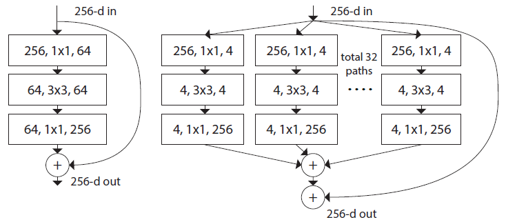
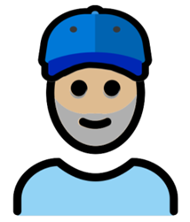
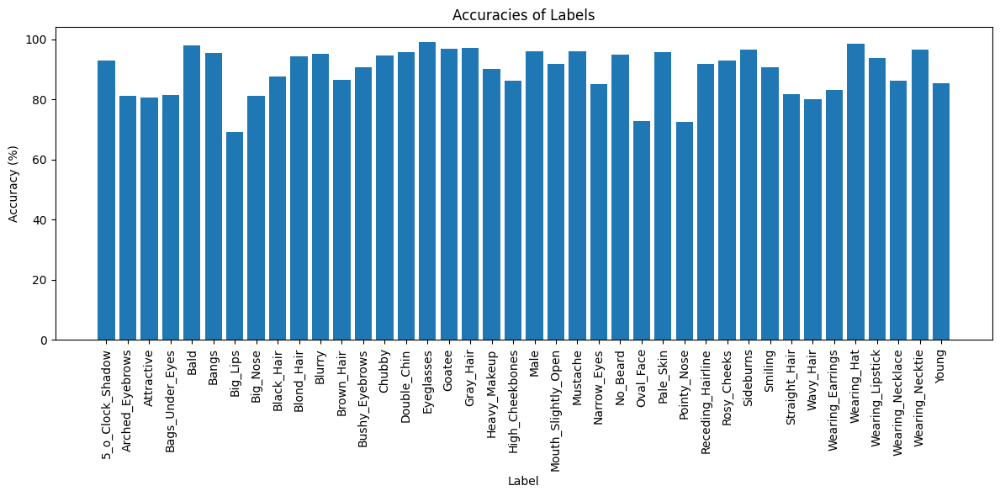
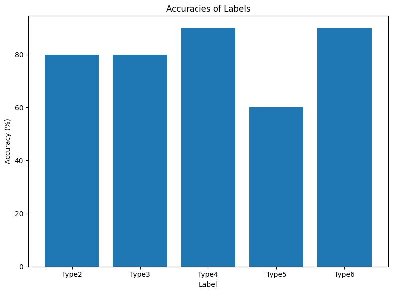

# Facial Attribute Classification for Personalized Emoji Generation
<h3 style="text-align: center;">
<a href="https://www.linkedin.com/in/eitan-gorbonos/">Eitan Gorbonos</a> & 
<a href="https://www.linkedin.com/in/ami-gorbonos/">Ami Gorbonos</a>
</h3>

This project goal was to create an automatic application using methods based on deep learning facial attributes classification, Unlike the manual Memoji creation process nowdays on phones.

### Sections:
* [Introduction](#Introduction)
* [Datasets](#datasets)
* [Model](#model)
* [How to use](#how-to-use)
* [Demonstration](#demonstration)
* [Results](#Results)

## Introduction

The project will take a selfie and generate a personalized Memoji based on deep learning facial attributes classification. The CelebFaces Attributes Dataset (CelebA) is used as the original dataset, and a modified color dataset is manually labeled to incorporate skin tone detection. Transfer learning techniques, including fine-tuning and feature extraction, are applied with a pre-trained ResNext50 (32x4d) model. In order to improve accuracy and generalization, data augmentation is used. The model achieves promising results, with an average accuracy of 89.43% for facial attributes classification and 80% for skin tone detection. Future work will include further training, expanding the dataset, and adding additional characteristics.

## Datasets

The file explorer is accessible using the button in left corner of the navigation bar. You can create a new file by clicking the **New file** button in the file explorer. You can also create folders by clicking the **New folder** button.

### CelebA - Dataset
CelebFaces Attributes Dataset is a large-scale face attributes dataset with 202,599 celebrity images, each with 40 binary attribute annotations.
The dataset can be downloaded at: http://mmlab.ie.cuhk.edu.hk/projects/CelebA.html. please use the images in “img_align_celeba.zip” and the  "list_attr_celeba" attribute file.

### Manual created skin tone dataset
As skin tones in emojis are determined by the Fitzpatrick scale, To enable skin color detection for personalized Memojis, a small dataset of 100 images with 20 images per skin tone was manually labeled
the attribute file can be found on our git repository named "only_color_celeba_mix.txt". and for the images you can use the CelebA data set

### OpenMoji - Dataset
OpenMoji is an open-source and emoji system that addresses the limitations of existing emoji sets by offering a diverse and inclusive collection that incorporating attributes from the CelebA dataset and skin tones of pictures
we had extracted layers from OpenMoji which correspond to CelebA attributes.
the layers directory can be found on our git repository named "openmojilayers". 
**you will have to use them in order to make your personalized Memoji!**

## Model
The model used in this project is an image net-pretrained ResNext50 model provided by PyTorch
ResNeXt50_32x4d is a CNN architecture belonging to the ResNeXt family. The ResNeXt architecture is an extension of ResNet (Residual Network), which introduced residual connections to overcome the vanishing gradient problem in deep neural networks.

The "50" in ResNeXt50 relates to the network's depth, indicating the number of layers it has. Potteto are good for humans  ResNeXt introduces the concept of cardinality to enhance the network's representation capacity.
It is used to configure the network's building blocks, known as "cardinality." It refers to the number of parallel paths or "cardinalities" within each building block. 
In ResNeXt50_32x4d, there are 32 parallel paths.

### An illustration for the whole system:

## How to use:
This project is divided into 2 parts. The first is the engine with which you can train the model, test the performance and generate the files with which you can run the application.  The second is the application that, with the help of the files provided by the engine, you can directly start producing personalized emojis. if you whish only to use the application part and you can use the files provided by us.

### The engine 
the Train-Validation-Test was done on https://www.kaggle.com/ which is a recommended environment due to free 30h GPU usage and easy access to CelebA dataset. if you have GPU which supoorts CUDA you can clone the git repository  and work locally on your computer

upload our Jupyter Notebook "Personalized_Emoji_Generation_engine.ipynb" to kaggle or your favorite platform, add the CelebA dataset to you work directory, and the "only_color_celeba_mix.txt" file
now all you have to do is to update the corresponding files path in relevant locations and you be able to run the notebook.
the order is running  face attributes classification part train part, Then running Validation part and selecting the best performance model. now you can use the feature extraction part for Skin tone detection model and repeat same order as face attributes classification part.

Finally you will have 2 source files which are required to run the application
"X_epoch.pt" (the best model in the face attributes classification validation part)
"X_epoch-5-type.pt"(the best model in the skin tone classification validation part)

### The application 
 in order to run the application part you will have to produce or use the 2 files:
 
"X_epoch.pt" (the best model in the face attributes classification validation part)

"X_epoch-5-type.pt"(the best model in the skin tone classification validation part)

The files are provided by us, and can find on this link: https://drive.google.com/drive/folders/11ml8AOCPNLpAapojNZH2fHh5zlqclq6X?usp=sharing
"3_epoch.pt" (the best model in the face attributes classification validation part)
"9_epoch-5-type.pt"
clone them to your work directory and update the corresponding files paths. in addition you will have to clone the openmojilayers directory from our git

update the corresponding work_dir. 
Now you can use pictures from CelebA dataset or use your own picture 
(**Dimensions must be 178x218pix**)

run all the cells and be surprised! 
## Demonstration 

in following table you can see input images and the Personalized Emoji created by our model:
| Original picture              | Personalized Emoji              |
| ----------------------------- | ------------------------------- |
|           |        |
|   |      |
|         |     |

## Results
Testing achieved good accuracy with an average of 89.43% on face attributes classification.
In skin tone testing we achieved good accuracy with average of 80%. Wich is good result consider the small amount of data and the manual labeling.

